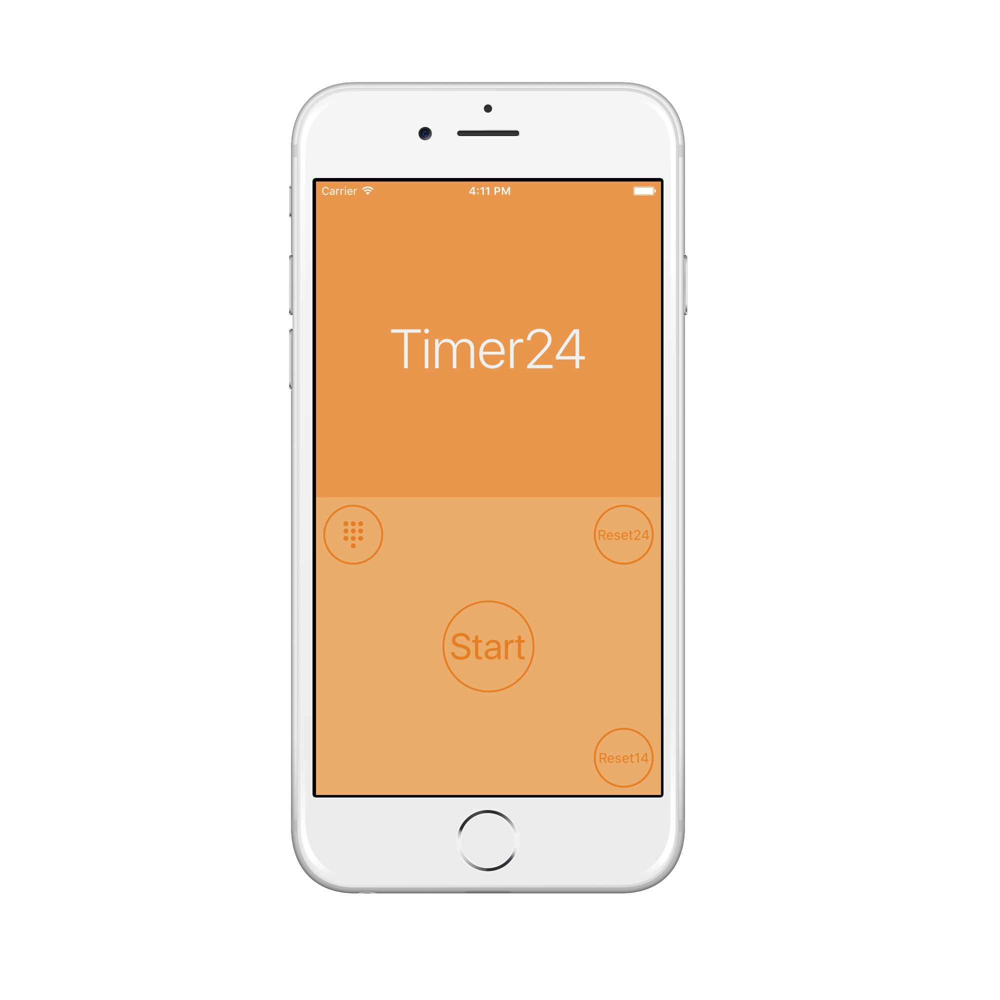
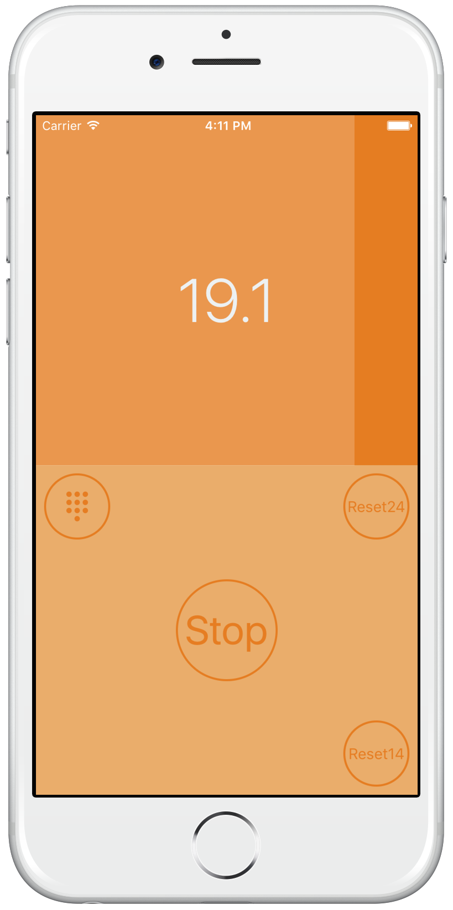

# Timer24
iOS Basketball Timer app

The purpose of this project is to develop a free iOS app for users who control the 24 seconds timer on a basketball game.
The timer is customed to restart at 24 seconds and 14 seconds. It will have a feature to custom the seconds.

# How it looks

  
  

